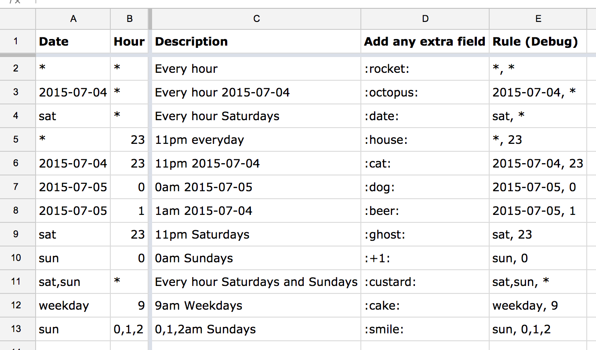
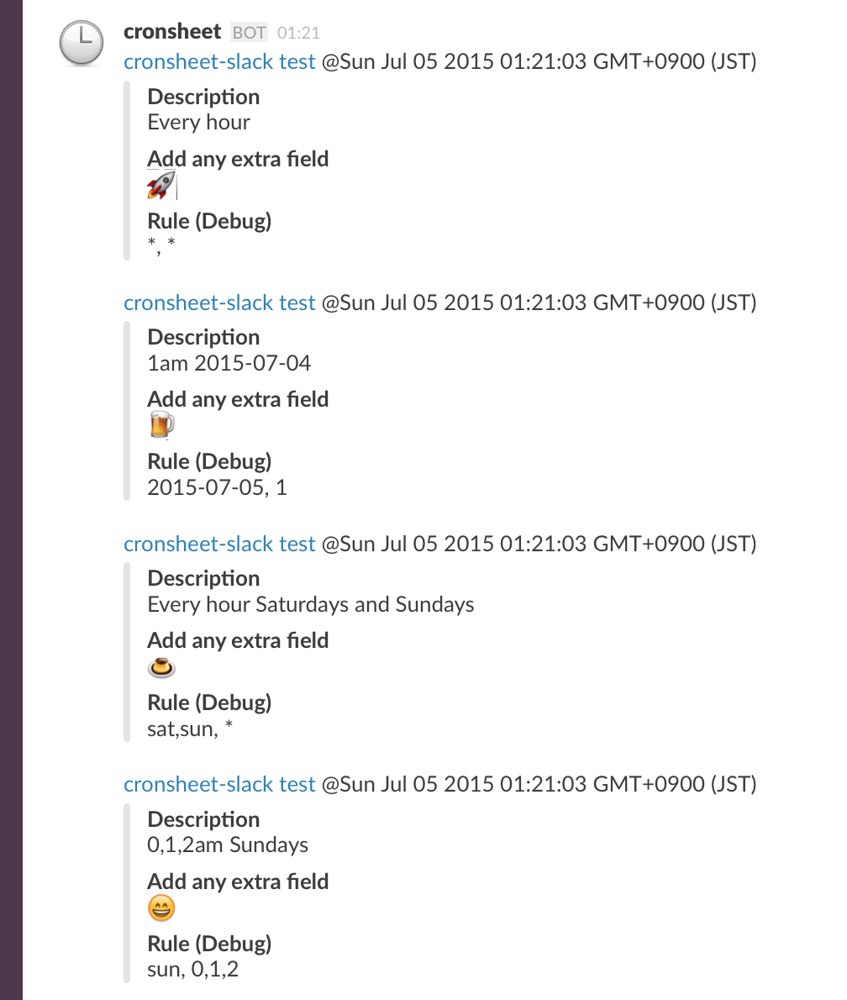

= gas-cronsheet-slack

Google Apps Script that schedules automated posts to Slack using Spreadsheets

== Installation

1. In the Slack channel where you want to post from the sheet, follow "Add a service integration..." in the menu.
2. Select "Incoming WebHooks" and create one. Copy the "Webhook URL" and set the value of `WEBHOOK_URL` variable in app.js to it.
3. Create a https://docs.google.com/spreadsheets/[Google Spreadsheet] with first row contains two cells, "date" and "hour" in this order.
4. In the sheet, follow the menu "Tools" > "Script editor...". Replace all of the code there with the contents of app.js.
5. In the script, follow the menu "Resources" > "Current project's triggers". "Add a new trigger" with "Run" of `doPost`, "Events" "Time-driven", "Hour timer" and "Every hour".

== Configuration

The 2nd row and below are the configuration for scheduled posts. They are configured as:

|===
| "Date" | "Hour" | Title1   | Title2   | ...
| _Date_ | _Hour_ | _Value1_ | _Value2_ | ...
| _Date_ | _Hour_ | _Value1_ | _Value2_ | ...
|===

The script posts the title-value pairs (column C and rightward) when the time matches the date and hour condition.
See examples.

=== Date format

The date (column A) can be one of:

- A date (as spreadsheet recognizes), eg. "2015-08-29".
- A comma-separated set of day names ("sun", "mon", "tue", "wed", "thu", "fri", "sat"), eg. "tue" or "sat,sun".
- "weekday" for a shorthand of "mon,tue,wed,thu,fri".
- "*" for everyday.

=== Hour format

The hour (column B) can be one of:

- A comma-separated set of 24-based hours eg. "3" or "13,14,15".
- "*" for every hour.

== Examples

=== The Sheet

=== The Slack

